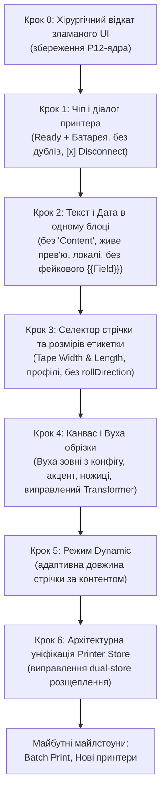

# Thermoprint (Standalone) — Master Roadmap & Architecture Plan

> **Єдине джерело правди (Single Source of Truth) для розробки проекту.**
> Усі попередні розрізнені плани зведені сюди. Виконання завдань ведеться суворо атомарно: один крок за раз із перевіркою та погодженням.

---

## 0. Стратегія міграції в окремий проект (Fork → Standalone)

Проект значно переріс оригінальний репозиторій `tomLadder/thermoprint`. Додано підтримку нових виробників (Phomemo P12 з термотрансферним протоколом), каталог з 200 000+ іконок Iconify, розширену кириличну типографіку та системні шрифти, поліграфічні штрих-коди OCR-B / GS1, кастомну механіку безперервної стрічки та вух обрізки.

### План відокремлення:
1. **Репозиторій та ідентичність:**
   - Створення окремого автономного репозиторію (або відв'язка форку через GitHub Support / новий remote).
   - Оновлення `package.json` у корені та пакетах (`name`, `repository`, `homepage`, `author`).
2. **Новий README.md:**
   - Повний опис проекту як незалежного веб-редактора для термо- та термотрансферних принтерів.
   - Реальна галерея підтримуваних пристроїв: **Phomemo P12** (Continuous/Tape), **Marklife P15, P12, P7** (Gap/Continuous), майбутні моделі.
   - Демонстрація ключових фіч (Iconify, системні шрифти, динамічна стрічка).
   - Видалення чужих спонсорських посилань; збереження належної ліцензійної атрибуції (MIT License, Original base by tomLadder).
3. **Очищення документації:**
   - Видалення застарілих тимчасових планів.
   - Актуалізація `CHANGELOG.md` та `docs/`.

---

## 1. Завершені та перевірені на залізі етапи

- [x] **Архітектурний стандарт драйверів:**
  - Конвенція назв `<vendor>-<model>.ts` (`pho-p12.ts`, `mark-p15.ts`, `mark-p12.ts`, `mark-m60.ts`).
  - Реєстр пристроїв з аліасами та розділенням протоколів.
  - Організація стороннього референсного коду в `.reference/` (git-ignored).
- [x] **Драйвер Phomemo P12 та стабілізація Windows BLE:**
  - Реверс-інжиніринг 6-пакетної ініціалізації (`1F 11 38...`).
  - Робочий протокол `pho-p12` (ESC/POS растр з поворотом 90°, unmetered потік).
  - Усунення блокувань WinRT: затримка стабілізації 3с (`waitForDeviceReady`), бекофф на 6 спроб, опціональні RX-сповіщення.
  - Блокування телеметрії батареї на звичайному P12 (запобігання зависанню прошивки від команди `1F 11 08`).
  - **Фізичний друк успішно працює на реальному пристрої!**
- [x] **Кирилична типографіка та локальні шрифти:**
  - 18+ кириличних веб-шрифтів з нормальними накресленнями (Regular, Bold, Italic).
  - Підтримка читання системних шрифтів користувача через `window.queryLocalFonts()`.
  - Запобігання мерехтінню та правильний трансформер тексту.
- [x] **Екосистема іконок Iconify:**
  - Інтеграція 150+ бібліотек іконок через батч-API (захист від лімітів Cloudflare 429).
  - Інлайн SVG-рендеринг та генерація Data URL без мережевих затримок.
- [x] **Штрих-коди GS1 / OCR-B:**
  - Справжній шрифт OCR-B за стандартом ISO 1073-2.
  - Динамічний розрахунок пропорцій баркодів без спотворень.

---

## 2. Атомарний план виправлення UI та розвитку

> ⚠️ **Правило реалізації:** Жодних масових правок. Кожен крок виконується окремо, тестується, надається користувачу на перевірку, і лише після схвалення починається наступний.

---

### Крок 0: Хірургічне очищення коду (Базовий санітарний відкат)
- **Ціль:** Прибрати непрацездатні експерименти попереднього агента, **суворо зберігаючи** драйвер P12 та низькорівневий Bluetooth.
- **Дії:**
  - Відкотити до чистого комміту `c5d0c62` тільки UI-файли:
    - `packages/web/src/editor/inspector/sections/text-section.tsx`
    - `packages/web/src/lib/date-format.ts`
    - `packages/web/src/editor/top-chrome/printer-chip.tsx`
  - Очистити `packages/web/src/editor/canvas/canvas.tsx` від зламаного HTML-оверлею вух, дефектного діалогу Custom та обрізаючого `<Group clipX>`.
  - Очистити `packages/web/src/editor/editor.tsx` від мертвого непрацюючого блоку auto-reconnect.
- **Критерій прийому:** Проект збирається без помилок, повертається стабільний інспектор шрифтів та чистий канвас.

---

### Крок 1: Чіп принтера, Діалог та статус «Завжди онлайн» [ЗАВЕРШЕНО ТА ПЕРЕВІРЕНО]
- [x] **1.1 Компактний збалансований чіп у верхній панелі:**
  - Симетричні відступи, компактна висота, статична крапка без пульсації.
  - Ліва частина: назва принтера та статус підключення (`Connecting`, `Standby`, `Connected`).
  - Права частина: піксельна іконка батареї та точний відсоток.
  - Кнопка `[×]` для швидкого розриву зв'язку у станах Connected та Standby.
  - Повне видалення модального вікна `ConnectFlow`, флоу перенесено на чіп у верхній лівий кут.
- [x] **1.2 Лаконічний діалог принтера (Flyout):**
  - Шапка: ім'я принтера з підписом `{vendor}-{protocol} · ID ...`.
  - Єдиний рядок статусу: `● Ready · 🔋 100%` (без громіздких плиток).
  - Лог з'єднання (Debug Log): автоматично ховає кнопки під час авто-підключення, розгортається при ручному відкритті.
- [x] **1.3 Декларативна ідентифікація моделей та виправлення батареї:**
  - Декларативний блок `DeviceIdentification` з RegEx-патернами для кожної моделі.
  - Уніфікація найменувань `{vendor}-{protocol}` (`pho-p12`, `mark-l11`, `mark-x2`) та `{vendor}-{model}`.
  - Виправлено баг «182%»: пакет моделі `02 b6 00` розпізнається як `type: "model"` і не забиває чергу очікування батареї.
  - Фізично перевірено на реальних пристроях **Phomemo P12** та **Marklife P15**.

---

### Крок 2: Текст і Дата в одному інструменті [ЗАВЕРШЕНО]
- **2.1 Інспектор тексту:**
  - [x] Видалено зайвий підпис `CONTENT` під словом `TEXT`.
  - [x] Прибрано кнопку `+ {{Field}}` та фіолетові заглушки (архітектурно перенесено у майбутній Milestone 5).
  - [x] Оновлено розкладку інспектора: секції `Text` та `Font` рознесені на чисті сусідні блоки.
  - [x] Повний вибір шрифтів (Google + локальні системні через `queryLocalFonts()`), дропдаун на всю ширину рядка.
  - [x] Параметри шрифту в один компактний рядок: `S [ 18 px ]`, `L [ 1.00 ]`, `T [ 0.0 px ]` з тултіпами та Shift-модифікатором (х4 крок).
  - [x] Піксельно чіткі 14×14 мікро-SVG для накреслень (`Bold`, `Italic`) та вирівнювання (`Left`, `Center`, `Right`) без жодного антиаліасингового розмиття.
  - [x] Виправлено центрування при повороті об'єкта (`rotateAroundCenter`) зі збереженням субпіксельної точності без биття.
- **2.2 Уніфікація роботи з датою:**
  - [x] Повна відмова від окремого фейкового інструмента «Date» у нижньому доці та мобільному меню.
  - [x] Дата як динамічні змінні `[[DD.MM.YYYY]]`, `[[HH:mm]]`, `[[DD.MM.YYYY +30d]]` безпосередньо у будь-якому тексті.
  - [x] Меню пресетів з іконкою `CalendarClock` та довідка синтаксису в шапці інспектора тексту.
  - [x] Шорткат `D` на полотні та команда в палітрі `⌘K` додають оптимальний 2-рядковий пресет: `[[DD.MM.YYYY]]\n[[HH:mm]]`.
  - [x] Живе оновлення дати на полотні (WYSIWYG) та гарантоване оновлення таймстампів перед відправкою на друк.

---

### Крок 3: Селектор стрічки та розмірів етикетки (Tape Width & Length Selector) [ЗАВЕРШЕНО ТА ПЕРЕВІРЕНО]
- [x] **3.1 Джерело розмірів виключно з профілів принтерів:**
  - Повне видалення мертвого випадкового масиву `FALLBACK_SIZES`.
  - Всі розміри беруться з `device/profiles/*.ts` зареєстрованих пристроїв (`pho-p12`, `mark-p15`, `mark-p12`, `mark-m60`).
- [x] **3.2 Розумний селектор під етикеткою на канві:**
  - **Якщо принтер має єдину ширину** (наприклад, Phomemo P12 = 12 мм):
    `[ 40 × 12 mm ▾ ]  [ ▤ ]` (перша пігулка ховається, оскільки вибору ширини нема).
  - **Якщо принтер відключений або мультиформатний** (Marklife P15/P12/M60):
    `[ 12 mm ▾ ]  [ 40 × 12 mm ▾ ]`
    (перший дропдаун обирає фізичну ширину касети й фільтрує довжини у другому).
  - **Кнопка `[ ▤ ]` (Dynamic switch)** показується на полотні тільки тоді, коли підключено стрічковий (`continuous`) принтер (поки задізейблена з тултіпом `"Dynamic length (coming in Step 5)"`).
  - У самому дропдауні розмірів пункт `Dynamic` присутній завжди (задізейблений з міткою `Soon`), що дозволяє проектувати макет під стрічку без принтера.
- [x] **3.3 Компактний мікро-діалог Custom:**
  - Для стрічки задається лише довжина відрізу: `Length [ 40 ] mm [-] [+]` (ширина зафіксована фізичною касетою).
  - Плавне введення без скидання цифр при Backspace/наборі через локальний строковий стан, керування коліщатком (Shift = 5мм) та кнопками.
- [x] **3.4 Очищення від рудиментів:**
  - Повне видалення кнопки рулону `rollDirection` та мертвого стану зі стору.

---

### Крок 4: Канвас, «Вуха» обрізки (Cutter Margins) та Transformer [ЗАВЕРШЕНО ТА ПЕРЕВІРЕНО]
- [x] **4.1 Візуалізація вух суворо ЗА МЕЖАМИ робочого полотна:**
  - Біла етикетка залишається 100% чистим білим полотном (строгий WYSIWYG).
  - Параметри вух беруться строго з конфігу підключеного пристрою (`profile.cutterMargins: { leadMm, trailMm }`).
  - Для P12 (9 мм lead + 9 мм trail):
    - «Вуха» малюються **зверху і знизу за межами білої канви** з відступом.
    - Штриховка використовує системний колір акценту (cyan).
    - Іконка ножиць ✂ розміщується всередині зони штриховки без зайвого тексту «9mm» чи тултіпів.
  - Вуха відображаються **виключно** для принтерів, що мають `cutterMargins` у профілі (P12). На інших принтерах або gap-етикетках вони приховані.
- [x] **4.2 Виправлення Konva Transformer:**
  - Елементи не заблоковані та не обрізані всередині `<Group clipX>`.
  - Рамка виділення, кутові маркери та верхня ручка обертання (rotation anchor) повністю видимі, доступні для кліку і не зрізаються краєм етикетки.

---

### Крок 5: Режим Dynamic (Адаптивна довжина стрічки за контентом) [ЗАВЕРШЕНО ТА ПЕРЕВІРЕНО]
- [x] **5.1 Автоматичний розрахунок:**
  - Довжина стрічки автоматично розраховується за крайньою правою точкою контенту:
    `довжина = max(x + width) + відступи (+ cutter margins для P12)`.
  - Модуль `packages/web/src/label/dynamic-label.ts` з підтримкою кутів обертання та симетричних відступів (контент збалансований між лівим вухом подачі та правим вухом обрізки з відступами 3 мм).
  - При додаванні, редагуванні тексту (інлайн та в інспекторі), зміні шрифтів, переміщенні або видаленні елементів довжина етикетки коректно підлаштовується в реальному часі.
  - Повне усунення тремтіння (jitter): зум і панорамування канвасу не скидаються при зміні довжини стрічки під час набору чи перетягування.
- [x] **5.2 Активація кнопки [ ▤ ] та селекторів:**
  - Кнопка `[ ▤ ]` активна, перемикає Dynamic/Fixed в один клік зі збереженням теми (`bg-accent/15 border-accent/40 text-accent`).
  - Пункт `Dynamic` у меню розмірів повністю функціональний (видалено бейдж `Soon` та блокування).
  - Пігулка розмірів відображає актуальну динамічну довжину (`Dynamic · {len} mm`).
  - Інтеграція з PrintSettingsFlyout (2-колонковий блок `[ Dynamic ] [ Custom... ]`), PrintButton та StatusBar (`CONT (DYN)`).
  - 8/8 юніт-тестів пройдено, повна збірка перевірена.

---

### Крок 6: Архітектурна уніфікація Printer Store [ЗАВЕРШЕНО ТА ПЕРЕВІРЕНО]
- [x] **usePrinterStore як єдине джерело правди:**
  - Периферія, з'єднання, батарея, статус та параметри принтера читаються виключно з `usePrinterStore`.
  - Повністю видалено рудиментарний об'єкт `printer` та `connectFlow` зі стору `useEditorV2Store`.
- [x] **Усунення ненадійних евристик імені моделі:**
  - У `cutter-ears.tsx` та `label-paper.tsx` прибрано крихкий парсинг `name.split(" ")[1]`; розрахунок полів різака читає канонічний `modelId` з `usePrinterStore`.
- [x] **Синхронізація шорткатів та статусів друку:**
  - Гаряча клавіша `⌘P` у `keyboard.ts` та кнопка `PrintButton` перевіряють актуальний статус зв'язку через `usePrinterStore.getState().isConnected`.
- [x] **Підтвердження команд щільності друку (Density):**
  - Перевірено кодову базу та референсні протоколи: команди `setDensity` повністю уніфіковані для Phomemo P12 (`1F 11 02`), Marklife L11/P15 (`1F 70 02` / `10 FF 10 00`) та Marklife X2. UI-селектор у налаштуваннях передає параметри напряму в драйвер.

---

## 3. Майбутній беклог (Future Backlog)

- [x] **Milestone 5: Шаблонізація, лічильники (`{{#:...}}`) та поля CSV (`{{Field}}`) [ЗАВЕРШЕНО ТА ПЕРЕВІРЕНО]**
  - **5.1 Єдиний рушій шаблонізатора (`template-engine.ts`)**:
    - **Суворий бінарний поділ**:
      - `{{#:...}}` — **Лічильник (Counter)**. Завжди починається з `{{#:`. Повністю автономний, не вимагає CSV.
      - `{{...}}` — **Поле CSV (Field)**. Будь-який запис без `#:`. Якщо колонка в Excel називається `#` або `##`, вона імпортується як `{{#}}` без конфліктів.
    - **Синтаксис лічильника `{{#: [Шаблон_старту] (Оператор_і_крок) }}`**:
      - **Оператори**:
        - `+-` — **Декремент (віднімання)**. При переході через нуль (`< 0`) друк негайно зупиняється.
        - `+` — **Інкремент (додавання)**.
        - відсутній — дефолтний крок `+1`.
      - **Принцип «Що написав — те й отримав» (нуль прихованих правил)**:
        - Розрядність задається нулями: `{{#:0000}}` (з 0000..), `{{#:0001}}` (з 0001..), `{{#:01}}` (з 01..), `{{#:1}}` (з 1..).
        - Символ `#` — звичайний текст: `{{#:#001}}` → `#001`, `{{#:Box #01}}` → `Box #01`.
        - Якщо чисел нема: `{{#:###}}` → `###1`, `###2`.
        - Префікси та суфікси: `{{#:SN-0001}}`, `{{#:BOX-001-A+1}}`.
        - Дробовий крок: `{{#:15.0+0.5}}` → `15.0`, `15.5`, `16.0`. Крапка фіксує точність, математика цілочисельна.
        - Фоллбек подвійного плюса: `{{#:0000+5+7}}` → береться перший крок `+5`.
    - **Поля з таблиці `{{Field}}`**:
      - Підстановка даних поточного рядка CSV (`row[field]`).
      - Підтримка змінних у тексті, QR-кодах та штрихкодах.
    - **Чистий WYSIWYG на полотні**:
      - На полотні відображаються реальні дані першого/обраного рядка CSV або лічильника без штучних рамок чи маркерів, що ламають вигляд.
  - **5.2 Робота з CSV та статус-бар**:
    - Легкий нуль-залежний CSV-парсер (`csv-parser.ts`) з автодетекцією `,`, `;`, `\t`, підтримкою лапок RFC 4180 та обрізанням UTF-8 BOM.
    - Індикатор активного файлу в статус-барі: `📄 filename.csv (row X/Y)` з кнопками гортання рядків для live-прев'ю та кнопкою вивантаження `✕`.
    - Drag-and-drop файлів `.csv` / `.tsv` безпосередньо у вікно редактора.
  - **5.3 Інспектор та дропдауни (Date та Fields)**:
    - Чисті кнопки в шапці секцій: `Date` та `Fields` (без дужок `[[ ]]` та `{{ }}`).
    - Іконка допомоги `(?)` (`HelpCircle`) у правому верхньому кутку кожного дропдауна — відкриває підпалітру синтаксису без зайвих кнопок «Назад» чи «Закрити».
    - Пряме введення імені поля в стилі Phomemo: інпут у верхній частині дропдауна полів для швидкої вставки `{{Field}}` за натисканням Enter / кнопки `+`.
    - Єдиний візуальний стиль: моноширинний `text-ink-200` з акцентом при наведенні, повна відсутність зайвих пояснень-лейблів праворуч та зразкових значень рядків.
  - **5.4 Базова логіка пакетного друку (True Dynamic для стрічки)**:
    - Ізоляція історії змін: `temporal.getState().pause()` запобігає засміченню стеку Undo/Redo.
    - **True Dynamic для стрічки**: кожен ярлик на безперервній стрічці перераховує довжину (`measureTextMetrics` + `fitDynamicLabel`) під реальний текст поточного запису ("Сало" vs "Рододендрон").
    - Точне розділення: токени дат `[[...]]` не вважаються пакетними завданнями, звичайний друк працює без примусового батч-режиму.
- [ ] **Milestone 6: Розширені налаштування принтера**
  - Вибір ширини картриджа (12, 14, 15 мм) для принтерів зі змінною шириною.
  - Налаштування density (щільності друку) для термотрансферу.
- [ ] **Milestone 7: Повний оверхаул пакетного друку (Batch Print) та статус-бару CSV**
  - Переосмислення та редизайн пакетного друку: відмова від громіздкої модалки на користь компактного та зручного рішення (обговорення і затвердження фінального UX).
  - Шліфування нижнього статус-бару для роботи з CSV-файлом (клікабельні зони, швидкі дії, адаптивність).
