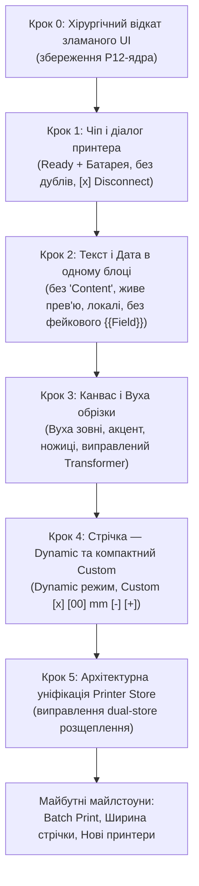

# Thermoprint (Standalone) — Master Roadmap & Architecture Plan

> **Єдине джерело правди (Single Source of Truth) для розробки проекту.**
> Усі попередні розрізнені плани зведені сюди. Виконання завдань ведеться суворо атомарно: один крок за раз із перевіркою та погодженням.

---

## 0. Стратегія міграції в окремий проект (Fork → Standalone)

Проект значно переріс оригінальний репозиторій `tomLadder/thermoprint`. Додано підтримку нових виробників (Phomemo P12 з термотрансферним протоколом), каталог з 200 000+ іконок Iconify, розширену кириличну типографіку та системні шрифти, поліграфічні штрих-коди OCR-B / GS1, кастомну механіку безперервної стрічки та вух обрізки.

### План відокремлення:
1. **Репозиторій та ідентичність:**
   - Створення окремого автономного репозиторію (або відв'язка форку через GitHub Support / новий remote).
   - Оновлення `package.json` у корені та пакетах (`name`, `repository`, `homepage`, `author`).
2. **Новий README.md:**
   - Повний опис проекту як незалежного веб-редактора для термо- та термотрансферних принтерів.
   - Реальна галерея підтримуваних пристроїв: **Phomemo P12** (Continuous/Tape), **Marklife P15, P12, P7** (Gap/Continuous), майбутні моделі.
   - Демонстрація ключових фіч (Iconify, системні шрифти, динамічна стрічка).
   - Видалення чужих спонсорських посилань; збереження належної ліцензійної атрибуції (MIT License, Original base by tomLadder).
3. **Очищення документації:**
   - Видалення застарілих тимчасових планів.
   - Актуалізація `CHANGELOG.md` та `docs/`.

---

## 1. Завершені та перевірені на залізі етапи

- [x] **Архітектурний стандарт драйверів:**
  - Конвенція назв `<vendor>-<model>.ts` (`pho-p12.ts`, `mark-p15.ts`, `mark-p12.ts`, `mark-m60.ts`).
  - Реєстр пристроїв з аліасами та розділенням протоколів.
  - Організація стороннього референсного коду в `.reference/` (git-ignored).
- [x] **Драйвер Phomemo P12 та стабілізація Windows BLE:**
  - Реверс-інжиніринг 6-пакетної ініціалізації (`1F 11 38...`).
  - Робочий протокол `pho-p12` (ESC/POS растр з поворотом 90°, unmetered потік).
  - Усунення блокувань WinRT: затримка стабілізації 3с (`waitForDeviceReady`), бекофф на 6 спроб, опціональні RX-сповіщення.
  - Блокування телеметрії батареї на звичайному P12 (запобігання зависанню прошивки від команди `1F 11 08`).
  - **Фізичний друк успішно працює на реальному пристрої!**
- [x] **Кирилична типографіка та локальні шрифти:**
  - 18+ кириличних веб-шрифтів з нормальними накресленнями (Regular, Bold, Italic).
  - Підтримка читання системних шрифтів користувача через `window.queryLocalFonts()`.
  - Запобігання мерехтінню та правильний трансформер тексту.
- [x] **Екосистема іконок Iconify:**
  - Інтеграція 150+ бібліотек іконок через батч-API (захист від лімітів Cloudflare 429).
  - Інлайн SVG-рендеринг та генерація Data URL без мережевих затримок.
- [x] **Штрих-коди GS1 / OCR-B:**
  - Справжній шрифт OCR-B за стандартом ISO 1073-2.
  - Динамічний розрахунок пропорцій баркодів без спотворень.

---

## 2. Атомарний план виправлення UI та розвитку

> ⚠️ **Правило реалізації:** Жодних масових правок. Кожен крок виконується окремо, тестується, надається користувачу на перевірку, і лише після схвалення починається наступний.



---

### Крок 0: Хірургічне очищення коду (Базовий санітарний відкат)
- **Ціль:** Прибрати непрацездатні експерименти попереднього агента, **суворо зберігаючи** драйвер P12 та низькорівневий Bluetooth.
- **Дії:**
  - Відкотити до чистого комміту `c5d0c62` тільки UI-файли:
    - `packages/web/src/editor/inspector/sections/text-section.tsx`
    - `packages/web/src/lib/date-format.ts`
    - `packages/web/src/editor/top-chrome/printer-chip.tsx`
  - Очистити `packages/web/src/editor/canvas/canvas.tsx` від зламаного HTML-оверлею вух, дефектного діалогу Custom та обрізаючого `<Group clipX>`.
  - Очистити `packages/web/src/editor/editor.tsx` від мертвого непрацюючого блоку auto-reconnect.
- **Критерій прийому:** Проект збирається без помилок, повертається стабільний інспектор шрифтів та чистий канвас.

---

### Крок 1: Чіп принтера, Діалог та статус «Завжди онлайн»
- **1.1 Компактний збалансований чіп у верхній панелі:**
  - Симетричні відступи, компактна висота, статична крапка без пульсації.
  - Ліва частина: назва принтера та статус підключення.
  - Права частина (батарея): симетрично в два рівні (іконка батарейки зверху, відсоток знизу, або збалансований компактний блок), щоб усунути візуальну асиметрію.
  - Стани чіпа:
    - **Connected:** Зелена крапка + Назва принтера + блок батареї (якщо є). Жодних дублюючих слів «Online» і «Connected».
    - **Standby:** Помаранчева крапка (`amber`) + `STANDBY` над назвою + **кнопка `[×]` для миттєвого розриву зв'язку**.
- **1.2 Лаконічний діалог принтера (Flyout):**
  - **Шапка:** `Phomemo P12` з приглушеним сірим підписом `pho-p12 · ID 42V...`.
  - **Єдиний рядок статусу (замість трьох гігантських плиток):**
    - Для принтерів з батареєю: `● Ready · 🔋 83%` (або вирівняний статус із зарядом).
    - Для принтерів без датчика батареї: `● Ready`.
    - Плитки `Status: Online`, `Model`, `Protocol` повністю видаляються (економія ~120px місця).
  - **Debug Log:**
    - Збільшення вікна до 8–10 рядків.
    - Видалення таймстампів з екранного списку (тільки чисті `[TX] 1F 11 38...` або `[RX] 1A 04...`).
    - Тултіп (hover) з повним текстом пакета при наведенні.
    - Збереження сирого hex-байта батареї в лозі (`1A 04 XX`) для точного калібрування з вольтметром користувача.
    - Кнопки «Download .log» / «Copy» зберігають повний лог з мілісекундами.
- **1.3 Логіка сесії «Завжди онлайн»:**
  - Якщо принтер дропнув GATT у проміжках простою — тримати сесію у Standby.
  - При натисканні на друк — тихий фоновий реконект без відкриття системного пікера і без повільного повторного опитування телеметрії (друк стартує негайно).
  - Кнопка `[×]` у чіпі або «Disconnect» у діалозі скидає збережений пристрій.

---

### Крок 2: Текст і Дата в одному інструменті [ЗАВЕРШЕНО]
- **2.1 Інспектор тексту:**
  - [x] Видалено зайвий підпис `CONTENT` під словом `TEXT`.
  - [x] Прибрано кнопку `+ {{Field}}` та фіолетові заглушки (архітектурно перенесено у майбутній Milestone 5).
  - [x] Оновлено розкладку інспектора: секції `Text` та `Font` рознесені на чисті сусідні блоки.
  - [x] Повний вибір шрифтів (Google + локальні системні через `queryLocalFonts()`), дропдаун на всю ширину рядка.
  - [x] Параметри шрифту в один компактний рядок: `S [ 18 px ]`, `L [ 1.00 ]`, `T [ 0.0 px ]` з тултіпами та Shift-модифікатором (х4 крок).
  - [x] Піксельно чіткі 14×14 мікро-SVG для накреслень (`Bold`, `Italic`) та вирівнювання (`Left`, `Center`, `Right`) без жодного антиаліасингового розмиття.
  - [x] Виправлено центрування при повороті об'єкта (`rotateAroundCenter`) зі збереженням субпіксельної точності без биття.
- **2.2 Уніфікація роботи з датою:**
  - [x] Повна відмова від окремого фейкового інструмента «Date» у нижньому доці та мобільному меню.
  - [x] Дата як динамічні змінні `[[DD.MM.YYYY]]`, `[[HH:mm]]`, `[[DD.MM.YYYY +30d]]` безпосередньо у будь-якому тексті.
  - [x] Меню пресетів з іконкою `CalendarClock` та довідка синтаксису в шапці інспектора тексту.
  - [x] Шорткат `D` на полотні та команда в палітрі `⌘K` додають оптимальний 2-рядковий пресет: `[[DD.MM.YYYY]]\n[[HH:mm]]`.
  - [x] Живе оновлення дати на полотні (WYSIWYG) та гарантоване оновлення таймстампів перед відправкою на друк.

---

### Крок 3: Канвас і «Вуха» обрізки (Cutter Margins)
- **3.1 Візуалізація вух суворо ЗА МЕЖАМИ робочого полотна:**
  - Біла етикетка залишається 100% чистим білим полотном (строгий WYSIWYG).
  - Для P12 (де є фізична відстань 9 мм lead + 9 мм trail між голівкою і ножем):
    - «Вуха» малюються **зверху і знизу за межами білої канви** з відступом.
    - Штриховка використовує системний колір акценту (ніякого червоного).
    - Іконка ножиць ✂ розміщується всередині зони штриховки.
    - Зайвий підпис «9mm» прибирається.
  - Вуха відображаються **виключно** для принтерів, що мають `cutterMargins` у профілі (P12). На інших принтерах або gap-етикетках вони приховані.
- **3.2 Виправлення Konva Transformer:**
  - Елементи не повинні бути заблоковані або обрізані всередині `<Group clipX>`.
  - Рамка виділення, кутові маркери та верхня ручка обертання (rotation anchor) повинні бути повністю видимі, доступні для кліку і не зрізатися краєм етикетки.

---

### Крок 4: Стрічка та розміри — Dynamic та мікро-Custom
- **4.1 Режим Dynamic (Адаптивна довжина):**
  - Режим стрічки, коли довжина етикетки автоматично розраховується за крайньою правою точкою контенту:
    `довжина = max(x + width) + відступи (+ cutter margins для P12)`.
  - При додаванні чи переміщенні елементів довжина етикетки коректно підлаштовується.
- **4.3 Реалістичні пресети стрічки:**
  - Замінити рандомні пресети (50, 60, 80) на розміри під реальні сценарії (наприклад, 25 мм, 30 мм, 40 мм, Dynamic).
- **4.4 Мікро-діалог Custom:**
  ```text
  ┌───────────────────────┐
  │ Custom            [×] │
  │ [ 25 ] mm   [-]  [+]  │
  └───────────────────────┘
  ```
  - Введення числа: підтримка Backspace, ручний набір будь-яких цифр, не скидає в 12 під час набору.
  - Крок 1 мм: плавне коліщатко миші або стрілки вводу.
  - Крок 10 мм: кнопки `[-]` та `[+]` для швидкої зміни розміру.
  - Жодних дублюючих браузерних спіннерів, сміттєвого тексту та кнопки-плацебо Apply.
  - Закриття діалогу: по кліку на `[×]` або кліку повз діалог.
  - **Збереження навігації канви:** зміна довжини стрічки НЕ скидає зум і панорамування користувача в (0,0).

---

### Крок 5: Архітектурна уніфікація Printer Store
- **Проблема:** Стан принтера розщеплений між `usePrinterStore` та `useEditorV2Store`, а їх синхронізація ведеться через побічні `useEffect` у модальному вікні `ConnectFlow`.
- **Рішення:**
  - `usePrinterStore` стає єдиним джерелом правди для перифірії, підключення, статусу та батареї.
  - `applyModelDefaults` коректно синхронізує `paperType` (щоб при підключенні P12 автоматично вмикався режим continuous).
  - Скидання розмірів етикетки відбувається лише при явній зміні принтера користувачем, а не при реконекті чи опитуванні батареї.

---

## 3. Майбутній беклог (Future Backlog)

- [ ] **Milestone 5: Шаблонізація та пакетний друк (`{{Field}}` / CSV)**
  - Розробка повноцінного рушія змінних шаблону.
  - Імпорт CSV/Excel файлів з автоматичним мапінгом колонок на поля етикетки.
  - Попередній перегляд записів (Record 1 of N).
  - Черга пакетного друку на фізичний принтер.
- [ ] **Milestone 6: Розширені налаштування принтера**
  - Вибір ширини картриджа (12, 14, 15 мм) для принтерів зі змінною шириною.
  - Налаштування density (щільності друку) для термотрансферу.
